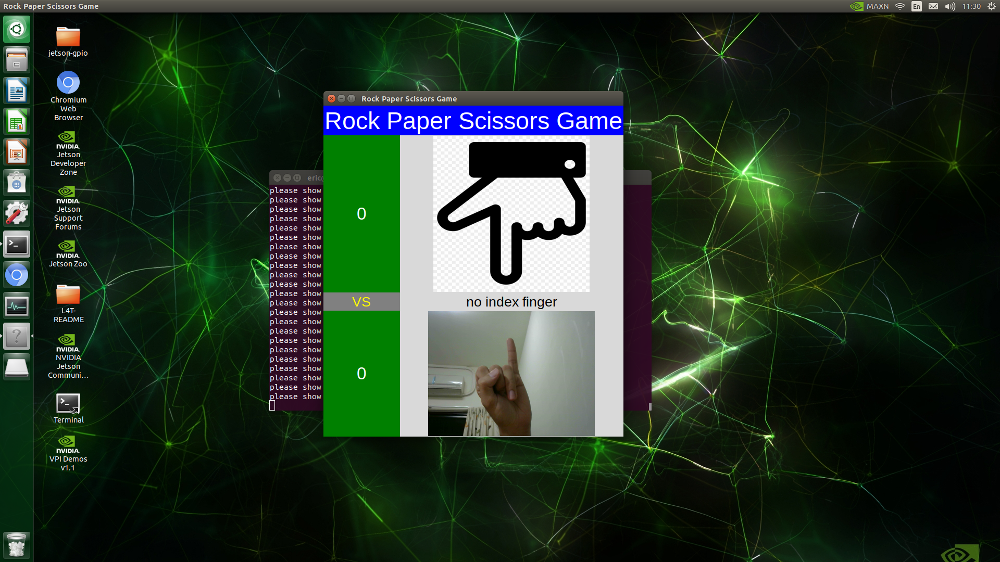

# Rock-Paper-Scissor-with-jeston-nano

## Description

## Prerequisite
### Jeston nano build up
1. Getting Started with Jetson Nano Developer Kit

https://developer.nvidia.com/embedded/learn/get-started-jetson-nano-devkit#intro

2. Have monitor, keyboard and mouse to deisplay and control nano

## Installation
### Step1: Library installation
1. cv2

It should be already built in Jetpack

2. tkinter

    sudo apt install python3-tk

3. pygame

    sudo apt install python3-pygame

4. mediapipe

Please refer reference 2

### Step2: Run code and start playing
1. Run code

    python3 mainWindow.py

2. Gameplay image

rock paper scissor

up down right left

wrong gameplay (all these situations are seen as losing point)

not show any gesture

show other gestures not related to game

when directing, player need to use inedx finger to show direction

## Codes Architecture 

## Reference
1. Rock Paper Scissor

https://github.com/mokpi/Rock-Paper-Scissors-with-Jetson-Nano

2. mediapipe installation on jeston nano

https://github.com/PINTO0309/mediapipe-bin

3. opencv + mediapipe hand recognition

https://blog.csdn.net/weixin_53403301/article/details/123232435?utm_medium=distribute.pc_relevant.none-task-blog-2~default~baidujs_baidulandingword~default-1.pc_relevant_paycolumn_v3&spm=1001.2101.3001.4242.2&utm_relevant_index=4
